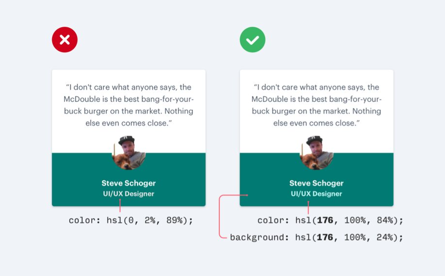

**Tip1** : 
-Sử dụng màu và font-weight để phân cấp thay cho kích 
thước

-Tôi thường có xu hướng tăng kích thước các phần 
tử , (thường là text) để truyền đạt sự quan trọng
thay vào đó , thử sử dụng color và font-weight;
Chú ý bôi đậm tiêu đề , và thay đổi màu chữ

 

**Tip 2** :
- Không sử dụng chữ màu ghi trên màu nền

;

- Phía bên trái , title của users là tông màu ghi . Mặc dù nhìn nó không xấu , chú ý cách thay đổi màu thành xanh nhạt
 , bổ sung vào màu nền xanh đậm , cải thiện khả năng đọc và cũng thiết lập hệ thống phân cấp 
 
 **Tip 3** : 
 
 Chia đều độ bóng mờ 
 
 ;
 
 - Thay vì phủ bóng với độ lớn xung quanh phần tử mẹ , phân đều độ bóng mờ và chênh lệch ít  hơn; 
 - Hãy nhớ rằng , vị trí đổ bóng cho phép người dùng của bạn , (thường là vô thức) , xác định nguồn sáng trong giao
  diện của bạn . Hãy hhất quán để ko phá vỡ hiệu ứng .
 - Bạn có thể sử dụng bóng đổ phía bên trong element.
 
 
 
 **Tip 4** : 
 - Sử dụng ít đường viền hơn ! Khá  niệm này được xây dựng từ vài tip trước 
 -Bản năng tự nhiên là sử dụng đường viền để định  nghĩa phân cách giữa element và phân đoạn của element , hoặc sử dụng
  đường viền để phác thảo element , và khiến chúng nổi lên từ các thành phần màu nền từ giao điện người dùng .
  
  
  -Thay vì sử dụng đường viền để phác thảo thẻ , chuyển đổi sang bóng mờ ;
  - Thay vì sử dụng đường viền để định nghĩa khoảng cách , sử dụng khoảng trống hoặc màu nền khác .
  
  
 -Với sửa đổi đơn giản này , các elements sẽ cảm thấy đỡ ngột ngạt , và đỡ giống so với những thiết kế từ 10 năm trước 
 
 **Tip 5** :
 - Đừng thổi phồng các biểu tượng có ý nghĩa nhỏ
 -Khoảng trống có thể là một trở  ngại . Đôi khi  ok và giúp dễ đọc . nhưng đôi lúc nó có thể giống như khoảng trống
  cần được lấp đầy . Tôi thấy điều này là đúng khi sử dụng chúng bên trong phần tử khác và tôi thường đẩy chúng lên c
  ỡ to để lấp đầy khoảng trống
  trống
  
  ;
  
  - Thay vì cố gắng tăng kích thước để chiếm không gian , cố gắng đặt chúng vào 1 khối với màu nền 
  phụ
  
  **Tip 6**
  - Sử dụng  đường viền đặc biệt thêm màu sắc cho 1 khối thiết kế đơn giản 
  nhẽo
  ;
  
  - Chúng ta đã ở đây và cùng xem những gì chúng ta đã thiết kế và nghĩ :
  - Nó quá trống trơn và đơn giản . Thật là nhàm chán khi nhìn nó . Tôi cần thêm ít màu.
  - Tôi có xu hướng quá đà và thêm nhiều màu sắc trước khi tôi biết điều này , toàn bộ màu nền của thẻ được tô bằng 1
   màu và thiết kế xem như không.
   - Thỉnh thoảng ít là nhiều , thay vì đi quá đà , đơn giản chỉ cần thêm đường viền có màu nổi bật vào thẻ , nó kh
   ông lấn át thiết kế nhung khắc phục được sự đơn giản của thành 
   phần
   
   
   **Tip 7**
   
   - Không phải button nào cũng cần màu nền 
   - Vấn đề này lớn và là 1 cái gì đó tôi đã thu thập từ các thiết kế 
   cũ
   - Luôn luôn thêm màu nền cho button , có thể khiến người dùng nhầm lẫn với hành động quan trọng trong giao diện của 
   bạn
   
   
   
   - Thay vì luôn luôn sử dụng màu nền primary , secondary , tertiary  , 
   
   - Hành động chính nên rõ ràng . Màu nền đồng nhất , sự tương phản cao 
   - Các hành động phụ phải rõ ràng nhưng không nổi bật , phác thảo hoặc có độ tương phản thấp hơn là lựa chọn tuyệt 
   vời
   - Các hành động thứ 3 có thể khám phá được nhưng không phô trương , kiểu của những hành động này thường giống nh
   ững liên kết thường là tốt nhất.
   
  - Sau đây là một vài ví dụ : 
  
  

   **Tip 8**
   
   - Suy nghĩ với dữ liệu từ cơ sở dữ 
   liệu
   
   
   - Đối với dev , thật dễ để chúng ta lấy được 1 đối tượng dữ liệu mà truy xuất từ backend và xuất giá trị ra giao
    diện . Không có sáng tạo và thiết kế cuối cùng trông rất giống dạng bảng.
    - Thay vào đó , đừng ngại trình bày dữ liệu theo hướng hữu ích hơn , nhấn mạnh nội dung quan trọng nhất và kết h
    ợp các nhãn và giá trị để thành cụm từ dễ đọc hơn 
    
   **Kết luận**
   - Thiết kế có thể khiến bạn sợ hãi , nhưng nó không cần thiết phải mà bạn sợ , ĐÚng vậy , tất cả các nhà thiết k
   ế mất nhiều năm để học và hiểu lý thuyết , và tất cả mọi thứ khác . Cần phải xây dựng giao diện người dùng để mang
    lại trải nghiệm người dùng tuyệt vời . Nhung đối với dev , chúng ta có thể thiết kế với chiến thuật nếu chúng ta
     thiếu tài năng
     -Tôi hy vọng với 8 tip  nhỏ này   có thể giúp bạn xác định sự thay đổi nhỏ mà bạn có thể thục hiện và cải thiện
      đáng kể với thiết kế của bạn 